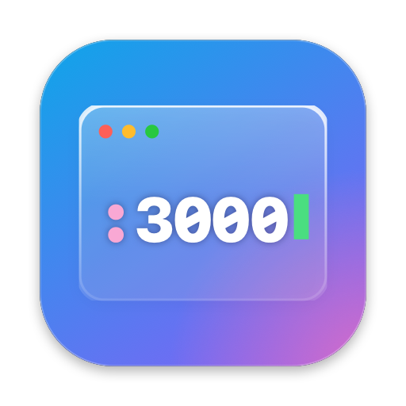

# PortBar

**Every open port on your Mac — one click away.**

PortBar lives in your menu bar and shows everything listening on your Mac: which process owns each port, which project folder it runs from, and **who started it** — you in a terminal, your editor, or an AI coding agent that spun up a dev server in the background and forgot about it. Stop anything in two clicks.



> **Download** → [portbar.developerpritam.in](https://portbar.developerpritam.in)

---

## Features

- **Knows who started it** — walks each process's parent chain to find the launcher (Claude Code, Codex, Gemini CLI, Aider, Cursor, VS Code, Zed, JetBrains, Terminal, iTerm2, Warp, Ghostty, tmux, Docker…). When the launching shell has already exited, it reads the environment the server inherited instead.
- **Stop in two clicks** — click ■, click again to confirm (SIGTERM). If the process ignores it, the button turns into **Force Kill** (SIGKILL). Hold ⌥ to force kill straight away.
- **See the project** — every port shows the folder it was started from; reveal it in Finder or open `localhost:<port>` in your browser.
- **Spot exposed ports** — servers listening on all interfaces get a `network` tag.
- **Live count in the menu bar** — the icon shows how many ports are open.
- **Open from anywhere** — press **⌃⌥P** (configurable) to open the panel with the search field focused; Return opens the top match in your browser.
- **Hide the menu bar icon** — turn off *Show Status Bar Icon* and use the shortcut instead, or open PortBar from Spotlight to bring the panel back.
- **Search & filter** — by port, process, folder, or launcher type. macOS and app-helper ports are hidden by default.
- **Liquid Glass panel** — native glass on macOS 26 (frosted blur on older versions), light and dark, sizes itself to its content. Drag it by the header to keep it open where you want it.
- **Built-in updates** — *Check for Updates…* (and an optional daily check) installs new GitHub releases in place and relaunches.
- **Tiny & private** — ~1 MB universal app, no dependencies, no permissions, no telemetry. The only network request is the optional update check to GitHub.

---

## Requirements

- macOS 14 Sonoma or later
- Apple Silicon or Intel Mac

No special permissions are needed. PortBar reads the same information as `lsof` and `ps`, and can only stop processes owned by your user.

---

## Installation (pre-built)

1. Download `PortBar.zip` from the [Releases](../../releases) page.
2. Unzip and drag **PortBar.app** to `/Applications`.
3. Open it. If macOS blocks it, go to **System Settings → Privacy & Security** and click **Open Anyway** (unsigned app — only needed once).
4. Click the terminal icon in your menu bar, or press **⌃⌥P**. Settings (status bar icon, shortcut, launch at login, updates) live in the `⋯` menu.

To uninstall: choose **Quit PortBar** from the `⋯` menu, then move `PortBar.app` to Trash.

---

## Building from source

**Prerequisites:** Xcode 15+ or the Xcode command line tools (`xcode-select --install`). No Xcode project needed — it's a Swift package.

```bash
git clone https://github.com/developer-pritam/mac-open-port.git
cd mac-open-port
./build.sh install     # build, copy to /Applications, launch
```

Other build commands:

```bash
./build.sh             # build/PortBar.app only
swift run PortBar      # run straight from the package (debug)
```

### Release build

```bash
./scripts/build-release.sh                      # dist/PortBar-<version>.zip
./scripts/build-release.sh --version 1.1.0 --publish   # also create a GitHub release (needs gh)
```

The version lives in the `VERSION` file.

### Regenerate the app icon

Icon designs are drawn in code in `scripts/IconDesigns.swift`.

```bash
./scripts/make-icon.sh preview   # compare all designs side by side
./scripts/make-icon.sh           # export the chosen one → Resources/AppIcon.icns + docs/assets/*.png
```

---

## Project structure

```
PortBar/
├── Sources/PortBar/
│   ├── main.swift            # NSApplication setup
│   ├── AppDelegate.swift     # Status item, glass panel lifecycle, menu bar glyph
│   ├── PortStore.swift       # Observable state, filtering, stop/force-kill, launch at login
│   ├── PortScanner.swift     # lsof/ps parsing, launcher detection
│   ├── PanelView.swift       # SwiftUI panel: header, search, filters, rows, settings menu
│   ├── Settings.swift        # Status bar icon, shortcut and update preferences
│   ├── HotKey.swift          # Global shortcut (Carbon RegisterEventHotKey, no permissions)
│   └── Updater.swift         # GitHub Releases update check + in-place install
├── Resources/AppIcon.icns
├── docs/                     # GitHub Pages website
├── scripts/
│   ├── build-release.sh      # Clean universal build → zip (+ GitHub release)
│   ├── IconDesigns.swift     # App icon + menu bar glyph designs
│   ├── make-icon.sh          # Export icon / preview sheet
│   ├── make-icon.swift
│   └── preview-icons.swift
├── build.sh                  # swift build → PortBar.app bundle
├── Package.swift
└── VERSION
```

---

## How it works (technical)

**Listening sockets** — `lsof -nP -iTCP -sTCP:LISTEN -F pn` gives every listening TCP socket with its PID in a machine-readable format. IPv4/IPv6 duplicates are merged per process.

**Process details** — one `ps -ax` pass collects parent PID, uptime, memory, user, full command and executable path for every process; `lsof -d cwd` gives each server's working directory.

**Who launched it** — PortBar walks up the parent chain and matches each ancestor's executable against known agents, editors, terminals and container runtimes; the nearest match wins. Servers started in the background are often re-parented to `launchd` once their shell exits, so PortBar falls back to the environment (`ps -E`) the server — or its nearest living ancestor — inherited: `CLAUDE_CODE_ENTRYPOINT`, `CODEX_*`, `TERM_PROGRAM`, `__CFBundleIdentifier` and friends.

**Stopping** — `kill(pid, SIGTERM)`, then polls for up to 1.5 s. Processes that survive are offered a SIGKILL.

**Panel** — a borderless, non-activating `NSPanel` at status-bar level. A plain container holds an `NSGlassEffectView` (macOS 26; `NSVisualEffectView` before that) and the `NSHostingView` side by side, both autoresizing with the window. The SwiftUI content reports its natural height and the panel resizes to fit, anchored under the menu bar; the list gets whatever height the header and footer leave and scrolls past that.

**Shortcut** — Carbon `RegisterEventHotKey`, which needs no Accessibility permission. Re-launching the app (`applicationShouldHandleReopen`) also opens the panel, so it's reachable with the icon hidden.

**Updates** — `GET api.github.com/repos/developer-pritam/mac-open-port/releases/latest`, compare the tag with `CFBundleShortVersionString`, download the release's `PortBar.zip`, unzip with `ditto`, verify the bundle identifier, swap it in with `FileManager.replaceItemAt`, and relaunch.

---

## Browser version

`server.js` + `public/` is an earlier, dependency-free web version of the same dashboard: `npm start` → http://localhost:7777.

---

## License

MIT License — see [LICENSE](LICENSE) for details.

Built by [Pritam](https://developerpritam.in) · [Buy me a coffee](https://developerpritam.in/donate)
